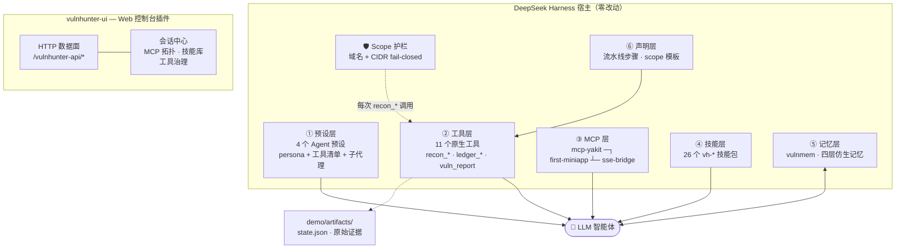
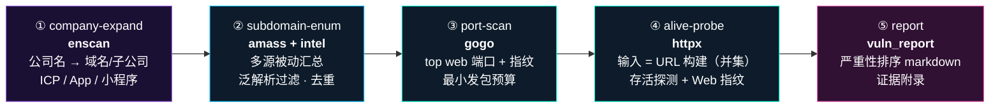

<div align="center">


# ⚡ VulnHunter

### AI 原生漏洞挖掘平台

**侦察流水线 · 证据门账本 · 跨会话记忆 · 授权护栏 —— 由 LLM 智能体端到端编排**

[](LICENSE)
[](#快速开始)
[](https://nodejs.org)
[](#-四大挖掘模式)
[](#-原生工具集)
[](#-技能库)

[English](README.md) · **简体中文**

</div>

---

> [!WARNING]
> ### 合规声明
> VulnHunter 仅供**已获授权**的安全测试使用——自有资产、SRC 平台收录范围、或持有书面授权的目标。
> Agent 人设与 scope 护栏双重硬禁止破坏性操作（删数据 / 脱库 / DoS / 篡改配置），默认信条为**被动优先**侦察。
> 使用者对所在地法律合规自负责任。使用本软件即视为接受本声明。

---

## 📑 目录

- [为什么是 VulnHunter](#-为什么是-vulnhunter)
- [架构总览](#-架构总览)
- [四大挖掘模式](#-四大挖掘模式)
- [侦察流水线](#-侦察流水线)
- [原生工具集](#-原生工具集)
- [攻击面账本](#-攻击面账本)
- [跨会话记忆](#-跨会话记忆)
- [技能库](#-技能库)
- [Web 控制台](#-web-控制台)
- [工具治理](#️-工具治理)
- [安全模型](#-安全模型)
- [快速开始](#-快速开始)
- [配置一览](#-配置一览)
- [常见问题](#-常见问题)
- [路线图](#%EF%B8%8F-路线图)
- [许可证](#-许可证)

---

## 💡 为什么是 VulnHunter

通用 AI 编码智能体能*描述*一次漏洞挖掘。VulnHunter **直接开挖**：

| 通用 Agent | VulnHunter |
|---|---|
| 即兴拼 shell 命令 | 驱动**确定性五步侦察流水线**：支持选段执行与断点续跑 |
| 声称"我发现了一个 XSS" | 每个发现进**三态账本**；升「已证实」必须有落盘的 raw HTTP 证据 |
| 下个会话全忘光 | **四层仿生记忆**：记得测过的目标、有效的 payload、死胡同 |
| 不知道授权边界在哪 | `scope.yaml` 授权文件被每个工具 **fail-closed** 强制校验，越界即拦截 |
| 一坨巨型 prompt | 四个实战化 Agent 预设 + 26 个进攻技能包 |

<div align="center"><i>结果：一个又快又负责任的作业者——每个结论都可回溯到磁盘上的证据。</i></div>

---

## 🏗 架构总览

VulnHunter 是开源 [DeepSeek Harness](https://github.com/deepseek-ai/deepseek-harness) Agent 平台的全栈插件套件，以六个正交层次 + 一个独立 Web 控制台挂载：



每份产物——子域清单、端口表、HTTP 响应、报告——都落在目标目录（`artifacts/`）下，账本的每个结论事后可审计。

---

## 🎭 四大挖掘模式

每个模式是一个完整的 Agent 预设——人设、工具清单、子代理拓扑、压缩策略，hero 页一键启动：

| | 模式 | 预设 | 信条 |
|---|---|---|---|
| 🟣 | **Nova — 全链路** | `vulnhunter` | 端到端挖掘：侦察 → 扫描 → 人工验证 → 分级报告。子代理干粗活，主 Agent 执掌账本。 |
| 🔴 | **Scout — 信息收集** | `vulnhunter-recon` | 纯情报获取：五步流水线，快、静、准。 |
| 🔵 | **Raider — Web 渗透** | `vulnhunter-web` | 单目标 Web 应用测试，yakit/chrome 双引擎验证。 |
| 🟢 | **Pebble — 小程序审计** | `vulnhunter-miniapp` | 微信小程序审计：反编译、静态分析、动态调试、密钥提取、接口越权。 |

---

## 🔄 侦察流水线

顺序固定、**支持选段**、断点续跑。会话里说一句*"只跑 1,2,4"*——编排器自动处理。



三种执行模式：`ask`（默认——主动步骤前先征求确认）、`auto`、`step`。确定性后处理（泛解析检测、URL 构建、去重）**零 AI token 消耗**。

针对演示目标（`example.com`，IANA 保留文档域）的一次真实运行已收录在 [`vulnhunter/demo/`](vulnhunter/demo/)——含生成的分级报告样例。

---

## 🧰 原生工具集

全部 11 个工具均过 scope 护栏。节选——完整参考见 [`vulnhunter/README-plugin.md`](vulnhunter/README-plugin.md)：

| 工具 | 用途 | 说明 |
|---|---|---|
| `recon_pipeline` | 五步流水线编排 | `steps:"1,2,4"` 选段执行；断点续跑 |
| `recon_status` | 运行历史与各步结论 | 表格视图 |
| `recon_enscan` | 公司资产测绘 | 域名 / 子公司 / ICP / App / 小程序 |
| `recon_amass` | 被动子域枚举 | 多源合并 + 泛解析过滤 |
| `recon_gogo` | 端口扫描 + 服务指纹 | top web 端口档位，最小发包 |
| `recon_httpx` | 存活探测 + Web 指纹 | 输入为构建好的 URL 清单 |
| `recon_intel` | FOFA / Shodan 被动情报 | 缺 key 明确报错——绝不静默降级 |
| `ledger_add` / `ledger_update` / `ledger_state` | 攻击面账本写入与读取 | 三态：`todo` → `suspected` → `confirmed` |
| `vuln_report` | 严重性排序漏洞报告 | Markdown + raw HTTP 证据附录 |

---

## 📒 攻击面账本

一台「诚实机器」。发现只会处于三态之一，且状态晋升有门禁：

```mermaid
flowchart LR
    TODO(["todo"]) -->|"观察到候选"| SUS(["suspected"])
    SUS -->|"❗ 证据门：<br/>raw HTTP 请求 + 响应<br/>指向 artifact"| CON(["confirmed ✅"])
    SUS -->|"证伪"| DEAD(["false positive"])
    style TODO fill:#111827,stroke:#64748b
    style SUS fill:#1e293b,stroke:#f59e0b
    style CON fill:#064e3b,stroke:#10b981
    style DEAD fill:#1f2937,stroke:#64748b
```



`vuln_report` 拒收任何低于 *confirmed* 的条目——最终报告里只有扛过对抗性自审的结论。上下文压缩后，`ledger_state` 把全部攻击面回放进 Agent 大脑，挖掘中途可无损续接。

---

## 🧠 跨会话记忆

`vulnmem` —— Python 实现的四层仿生记忆系统：

| 层 | 类比 | 内容 |
|---|---|---|
| 工作记忆 | 海马体 | 当前会话状态、活跃假设 |
| 情景记忆 | 自传体 | 按目标的挖掘历史、时间线 |
| 语义记忆 | 皮层 | 提炼知识：攻击模式、工具怪癖 |
| 程序记忆 | 小脑 | 学到的过程：什么有效、步骤序列 |

Agent 会话开始时查询记忆（"关于这个目标我已经知道什么？"），结束后沉淀新知——不再重复踩坑。

---

## 📚 技能库

[`vulnhunter/skills/`](vulnhunter/skills/) 内置 26 个精选进攻技能包：

`vh-sqli` · `vh-xss` · `vh-rce` · `vh-ssrf` · `vh-ssti` · `vh-xxe` · `vh-idor` · `vh-jwt` · `vh-oauth` · `vh-webaudit` · `vh-osint` · `vh-sub` · `vh-memory` · `vh-jss` *(JS 侦察流水线)* · `vh-yakit-*` *(Yakit 深度集成 × 6)* …

`scripts/install.ps1` 一次安装即自动注册进 Agent 技能注册表——往 `$DSH_HOME/skills` 丢新目录即可扩展。

---

## 🖥 Web 控制台

不是聊天记录——是一套完整的作战仪表盘，作为第二个插件（`vulnhunter-ui`）发布，自带 HTTP 数据面。

<div align="center">

<p><sub>启动器：四模式卡 + 工作区选择，默认赛博暗黑。</sub></p>
</div>

### 会话中心
<div align="center">

<p><sub>带预设标签的挖掘会话；一键回到上次中断的位置。</sub></p>
</div>

### 实时服务拓扑
<div align="center">

<p><sub>dsh web / yakit / 小程序桥的探活状态与本地工具链，渲染成实时链路图。</sub></p>
</div>

### 交互式工具箱与流水线拓扑
<div align="center">

<p><sub>侦察流水线渲染账本中的真实运行历史——各步骤状态与耗时。</sub></p>
</div>
<div align="center">

<p><sub>工具开关 + 每工具自定义指令，即时持久化。</sub></p>
</div>

---

## ⚙️ 工具治理

治理状态持久化到 `vulnhunter/config/ui-tools.json`，Agent 下个会话即生效：

```json
{
  "disabled": ["recon_intel"],
  "instructions": {
    "recon_gogo": "只探测 80、443、8080 端口。禁止触碰匹配 /backup|/dump 的路径。"
  }
}
```

- **`disabled`** — 从 Agent 可调用集合中收回
- **`instructions`** — 每工具信条覆盖，叠加在工具内建行为之上（留空 = 默认）

---

## 🛡 安全模型

| 机制 | 保证 |
|---|---|
| **Scope 护栏** | `scope.yaml` 插件启动即加载；每个 `recon_*` 目标执行前过域名 + CIDR 校验。Fail-closed：无法判定 = 拦截。 |
| **证据门** | `confirmed` 状态必须携带 raw HTTP artifact 指针；`vuln_report` 拒收无证据断言。 |
| **被动优先信条** | 人设偏好被动情报源；主动扫描按轮次显式选择（默认 `ask`）。 |
| **红线操作** | 删数据、脱库、DoS、篡改配置——人设与护栏双重禁止。 |
| **密钥卫生** | 情报 key 只从环境变量读取；缺失时大声报错，绝不静默降级。 |
| **零遥测** | 所有数据留在你机器上。 |

授权范围文件示例：

```yaml
target: acme-src
domains:
  - acme.com
  - "*.acme.dev"
excludes:
  - dev.acme.com          # 第三方托管
cidr:
  - 203.0.113.0/24        # 显式基础设施许可
authorized_by: "SRC 平台单号 #1234"
valid_until: "2026-12-31"
```

---

## 🚀 快速开始

### 前置条件

| 要求 | 说明 |
|---|---|
| Node.js ≥ 22 + pnpm | 插件运行时与构建 |
| Python ≥ 3.8 | 跨会话记忆系统 |
| [DeepSeek Harness](https://github.com/deepseek-ai/deepseek-harness) 检出副本 | 宿主平台，依赖已装 |
| LLM API key | 如 Harness 使用的 `DEEPSEEK_API_KEY` |
| 侦察二进制（可选） | enscan / amass / gogo / httpx——自行下载，经 `TOOLS_DIR` 接入 |

> 🔐 **密钥卫生**：`FOFA_EMAIL` / `FOFA_KEY` / `SHODAN_KEY` 只从环境变量读取。enscan 数据源 Cookie 请保持在仓库之外——发布模板值为空。

### 安装

```powershell
# 1) 构建 Agent 插件
cd vulnhunter
npm install && npm run build

# 2) 安装预设 + 技能 + 记忆 + dist 到 $DSH_HOME（~/.dsh）
powershell -ExecutionPolicy Bypass -File scripts\install.ps1

# 3) 构建 Web UI 插件
cd ..\vulnhunter-ui
npm install && npm run build
```

### 接入 Harness

把 [`integration/cordis.patch.example.yml`](integration/cordis.patch.example.yml) 中的清单块追加到你 Harness 检出目录的 `packages/bundle/web-app/cordis.patch.yml`，然后：

```powershell
pnpm run build
pnpm dsh web          # → http://127.0.0.1:3080
```

### 备选：路径 overlay（无需 bundle 接线）

```powershell
$env:VULNHUNTER_ROOT = 'C:/path/to/vulnhunter'
$env:TOOLS_DIR       = 'C:/path/to/tools'
pnpm dsh web --patch C:/path/to/vulnhunter/dev.patch.yml
```

### 第一轮挖掘

打开控制台 → 选工作区 → 点 **Nova** → 输入：

> 对 demo 目标执行一轮完整侦察，并把结果写入账本

`demo` = `example.com`（IANA 保留文档域——定义上即可安全探测）。自己的授权目标请复制 [`vulnhunter/config/scope.example.yaml`](vulnhunter/config/scope.example.yaml) 改写。

---

## ⚙ 配置一览

| 文件 | 用途 |
|---|---|
| `vulnhunter/config/scope.example.yaml` | 授权范围模板——域名、排除项、CIDR、签批字段 |
| `vulnhunter/config/steps.default.yaml` | 流水线步骤定义（工具、参数、档位） |
| `vulnhunter/config/ui-tools.json` | 工具治理（Web UI 工具箱自动写入） |
| env: `FOFA_EMAIL` / `FOFA_KEY` / `SHODAN_KEY` | 情报平台凭据 |
| env: `DEEPSEEK_API_KEY` | Harness 本身消费的 LLM key |
| env: `VULNHUNTER_ROOT` / `TOOLS_DIR` | 路径 overlay 接线（开发模式） |

定制指南：[`vulnhunter/docs/customize.md`](vulnhunter/docs/customize.md)。

---

## ❓ 常见问题

<details>
<summary><b>这只是个 prompt 包吗？</b></summary>

不是。它带了注册进 Agent 工具注册表的 11 个原生 TypeScript 工具、确定性后处理的声明式流水线引擎、持久化账本、Python 记忆服务、以及带独立 HTTP 数据面的双插件 Web 控制台。Prompt（人设）负责协调这些组件，不能取代它们。
</details>

<details>
<summary><b>必须打互联网目标吗？</b></summary>

不需要。demo 目标是 example.com，纯本地 scope 也能跑。未配 FOFA/Shodan key 时 <code>recon_intel</code> 明确报错、被动 OSINT 优雅跳过。
</details>

<details>
<summary><b>技能需要的二进制没装怎么办？</b></summary>

技能按组件降级——例如 JS 侦察流水线会放弃 AST 提取、保留正则提取，并在日志中说明跳过了什么。
</details>

<details>
<summary><b>能加自定义工具或预设吗？</b></summary>

可以。预设是纯 cordis YAML 目录；技能是 <code>$DSH_HOME/skills</code> 下的拖入式文件夹；工具箱治理文件支持按部署约束任意组合。参见 <code>vulnhunter/docs/customize.md</code>。
</details>

<details>
<summary><b>为什么要以插件形式而不是独立程序？</b></summary>

会话管理、沙箱执行、权限控制、MCP 传输这些硬问题 DeepSeek Harness 已经解决得很好。VulnHunter 选择复用，而不是重造。
</details>

---

## 🗺 路线图

- [ ] 工具执行层直接消费 `ui-tools.json`（UI 数据面已就绪）
- [ ] 并发访问产物的 SQLite 后端
- [ ] 基于账本历史的桌面级趋势仪表盘
- [ ] 更多 MCP 桥（Burp Suite、Nuclei runner）
- [ ] Linux CI 与打包 release

欢迎贡献——仓库约定见 [`vulnhunter/AGENTS.md`](vulnhunter/AGENTS.md)。

---

## 📄 许可证

[MIT](LICENSE)。许可证授予代码权利，不授予攻击授权——见顶部合规声明。

第三方组件及其许可证：[THIRD-PARTY-NOTICES.md](THIRD-PARTY-NOTICES.md)。

---

<div align="center">

**⚡ 指向你获权测试的目标——然后让它开挖。**

*基于开源 [DeepSeek Harness](https://github.com/deepseek-ai/deepseek-harness) Agent 平台构建。*

</div>
