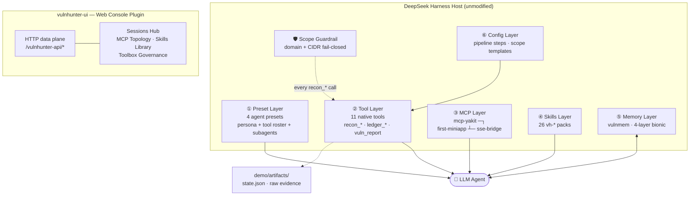
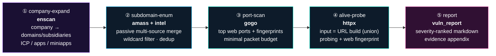
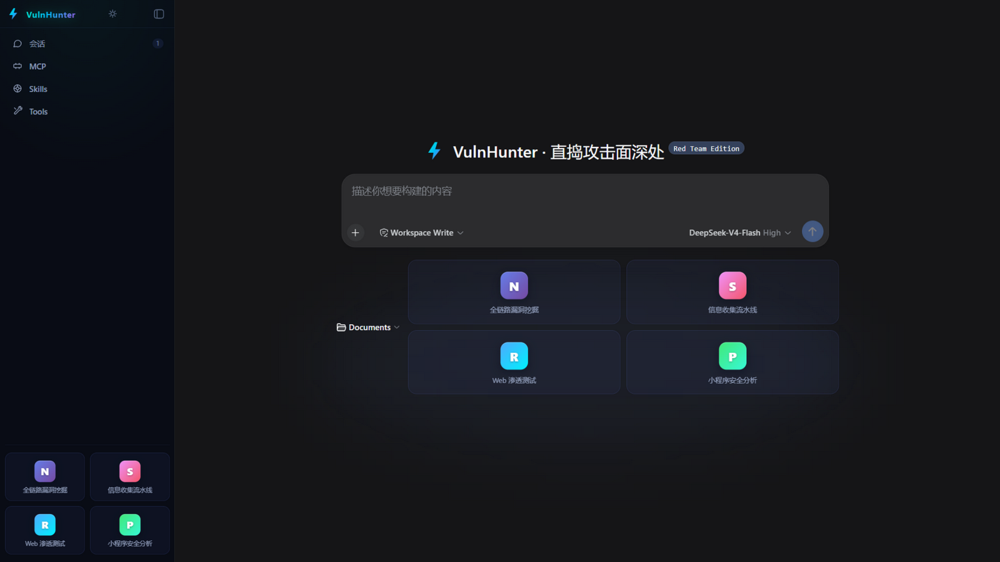
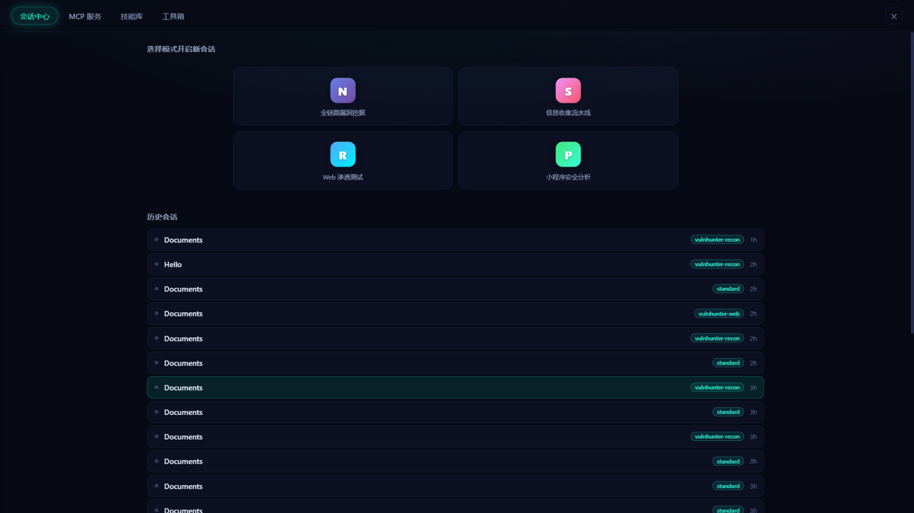
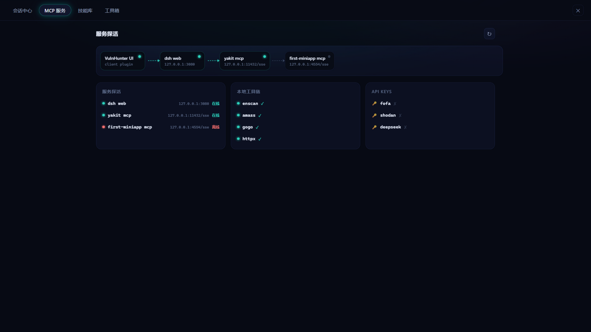
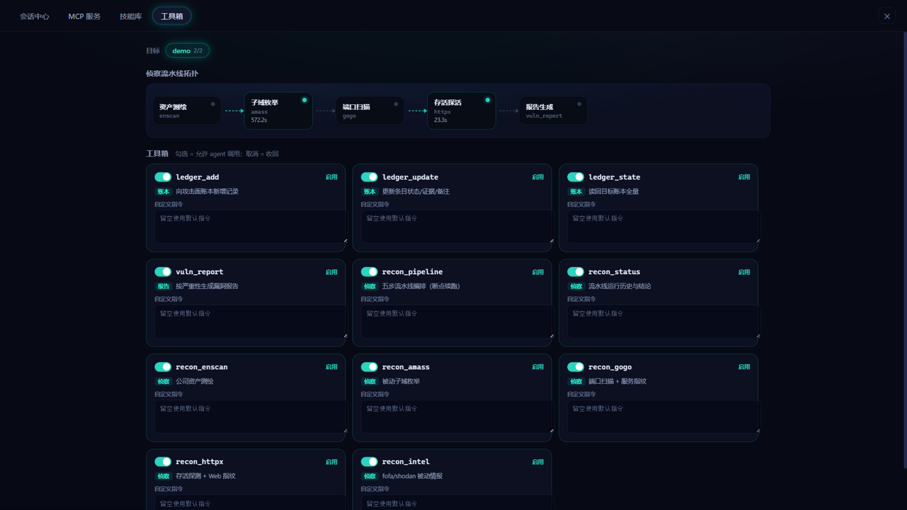
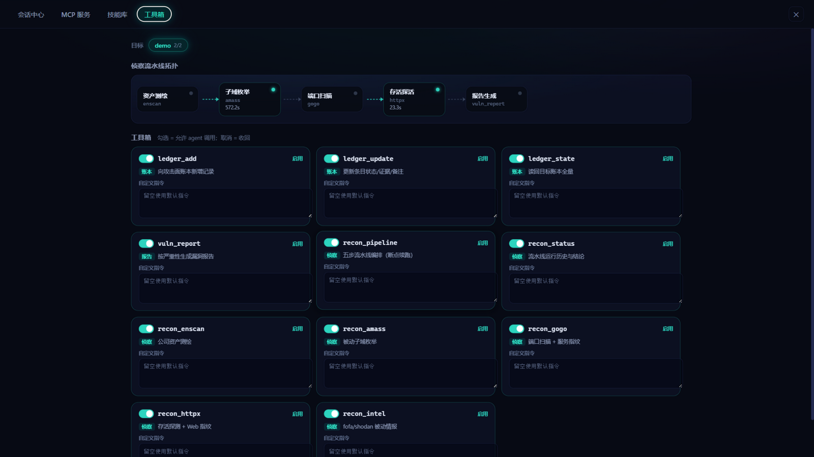

# ⚡ VulnHunter

### The AI-Native Vulnerability Hunting Platform

**Recon pipeline · Evidence-gated ledger · Cross-session memory · Scope guardrails — orchestrated end-to-end by an LLM agent**

[](LICENSE)
[](#quick-start)
[](https://nodejs.org)
[](#-the-four-hunting-modes)
[](#-native-toolset)
[](#-skills-library)

**English** · [简体中文](README-CN.md)

</div>

---

> [!WARNING]
>
> ### Compliance Notice
>
> VulnHunter is built for **authorized** security testing only — assets you own, bug-bounty / SRC program scope, or engagements with written authorization.
> The agent persona and the scope guardrail both hard-block destructive operations (data destruction, database dumping, DoS, config tampering), and the default doctrine is **passive-first** reconnaissance.
> You are solely responsible for legal compliance in your jurisdiction. Using this software constitutes acceptance of these terms.

---

## 📑 Table of Contents

- [Why VulnHunter](#-why-vulnhunter)
- [Architecture](#-architecture)
- [The Four Hunting Modes](#-the-four-hunting-modes)
- [The Recon Pipeline](#-the-recon-pipeline)
- [Native Toolset](#-native-toolset)
- [Attack-Surface Ledger](#-attack-surface-ledger)
- [Cross-Session Memory](#-cross-session-memory)
- [Skills Library](#-skills-library)
- [Web Console](#-web-console)
- [Tool Governance](#%EF%B8%8F-tool-governance)
- [Security Model](#-security-model)
- [Quick Start](#-quick-start)
- [Configuration](#-configuration)
- [FAQ](#-faq)
- [Roadmap](#%EF%B8%8F-roadmap)
- [License](#-license)

---

## 💡 Why VulnHunter

Generic AI coding agents can *describe* a vulnerability hunt. VulnHunter **runs one**:

| Generic agent                   | VulnHunter                                                   |
| ------------------------------- | ------------------------------------------------------------ |
| Freestyles shell commands       | Drives a **deterministic 5-step recon pipeline** with partial runs & breakpoint resume |
| Asserts "I found an XSS"        | Every finding enters a **three-state ledger**; `confirmed` requires artifact-backed raw-HTTP proof |
| Forgets everything next session | **Four-layer bionic memory** recalls tested targets, working payloads, dead ends |
| No idea what's in scope         | A `scope.yaml` authorization file enforced **fail-closed** by every tool, before any packet leaves the host |
| One giant prompt                | Four battle-tested agent presets + 26 offensive skill packs  |

<div align="center"><i>The result: an operator that is fast <b>and</b> accountable — every claim traceable to evidence on disk.</i></div>

---

## 🏗 Architecture

VulnHunter is a full-stack plugin suite for the open-source [DeepSeek Harness](https://github.com/deepseek-ai/deepseek-harness) agent platform. It mounts as six orthogonal layers plus a dedicated Web console:



Every artifact — subdomain lists, port tables, HTTP responses, reports — lands on disk under the target directory (`artifacts/`), so the ledger's claims are always auditable after the fact.

---

## 🎭 The Four Hunting Modes

Each mode is a complete agent preset — persona, tool roster, subagent topology, compaction policy — one click from the hero screen:

|      | Mode                       | Preset               | Doctrine                                                     |
| ---- | -------------------------- | -------------------- | ------------------------------------------------------------ |
| 🟣    | **Nova — Full Chain**      | `vulnhunter`         | End-to-end hunting: recon → scan → manual verification → severity-rated report. Subagents handle grunt work; the lead agent owns the ledger. |
| 🔴    | **Scout — Recon**          | `vulnhunter-recon`   | Pure information gathering via the five-step pipeline. Fast, passive-first, zero noise. |
| 🔵    | **Raider — Web Pentest**   | `vulnhunter-web`     | Single-target web application testing with yakit/chrome dual-engine verification. |
| 🟢    | **Pebble — MiniApp Audit** | `vulnhunter-miniapp` | WeChat mini-program audit: decompile, static analysis, dynamic debugging, hardcoded-secret extraction, API misuse. |

---

## 🔄 The Recon Pipeline

Fixed ordering, **partial runs**, breakpoint resume. Say *"only run steps 1,2,4"* — the orchestrator handles it.



Three execution modes: `ask` (default — agent proposes before active steps), `auto`, and `step`. Deterministic post-processing (wildcard detection, URL building, dedup) consumes **zero AI tokens**.

A real run against the demo target (`example.com`, IANA-reserved documentation domain) ships in [`vulnhunter/demo/`](vulnhunter/demo/) — including the generated severity report.

---

## 🧰 Native Toolset

All 11 tools pass through the scope guardrail. Partial list — full reference in [`vulnhunter/README-plugin.md`](vulnhunter/README-plugin.md):

| Tool                                            | Purpose                              | Notes                                                       |
| ----------------------------------------------- | ------------------------------------ | ----------------------------------------------------------- |
| `recon_pipeline`                                | Orchestrate the 5-step pipeline      | `steps:"1,2,4"` partial runs; resume from breakpoints       |
| `recon_status`                                  | Run history & per-step conclusions   | Table view of past executions                               |
| `recon_enscan`                                  | Company asset mapping                | Domains / subsidiaries / ICP / apps / miniapps              |
| `recon_amass`                                   | Passive subdomain enumeration        | Multi-source merge + wildcard filtering                     |
| `recon_gogo`                                    | Port scan + service fingerprint      | Top-web-port profile, minimal packets                       |
| `recon_httpx`                                   | Alive probing + web fingerprint      | Consumes the built URL list                                 |
| `recon_intel`                                   | FOFA / Shodan passive intelligence   | Explicit error when keys missing — never silent degradation |
| `ledger_add` / `ledger_update` / `ledger_state` | Attack-surface ledger writes & reads | Three states: `todo` → `suspected` → `confirmed`            |
| `vuln_report`                                   | Severity-ranked vulnerability report | Markdown, with raw-HTTP evidence appendix                   |

---

## 📒 Attack-Surface Ledger

The honesty machine. Findings live in exactly one of three states, and promotion is gated:

```mermaid
flowchart LR
    TODO(["todo"]) -->|"candidate observed"| SUS(["suspected"])
    SUS -->|"❗ evidence gate:<br/>raw HTTP request + response<br/>pointing at an artifact"| CON(["confirmed ✅"])
    SUS -->|"disproved"| DEAD(["false positive"])
    style TODO fill:#111827,stroke:#64748b
    style SUS fill:#1e293b,stroke:#f59e0b
    style CON fill:#064e3b,stroke:#10b981
    style DEAD fill:#1f2937,stroke:#64748b
```



`vuln_report` refuses anything below *confirmed* — so the final report contains only what survived adversarial self-review. On context compaction, `ledger_state` replays the full surface back into the agent's head, letting it resume mid-hunt without losing progress.

---

## 🧠 Cross-Session Memory

`vulnmem` — a four-layer bionic memory system in Python:

| Layer      | Analogy       | Content                                           |
| ---------- | ------------- | ------------------------------------------------- |
| Working    | hippocampus   | Current session state, active hypotheses          |
| Episodic   | autobiography | Per-target hunting history, timelines             |
| Semantic   | cortex        | Distilled knowledge: attack patterns, tool quirks |
| Procedural | cerebellum    | Learned procedures: what worked, step sequences   |

The agent consults memory at session start ("what do I already know about this target?") and consolidates findings afterwards — stopping repeat footwork across sessions.

---

## 📚 Skills Library

26 curated offensive skill packs ship in [`vulnhunter/skills/`](vulnhunter/skills/):

`vh-sqli` · `vh-xss` · `vh-rce` · `vh-ssrf` · `vh-ssti` · `vh-xxe` · `vh-idor` · `vh-jwt` · `vh-oauth` · `vh-webaudit` · `vh-osint` · `vh-sub` · `vh-memory` · `vh-jss` *(JS recon pipeline)* · `vh-yakit-*` *(Yakit deep integration × 6)* …

Install them once (`scripts/install.ps1`) and they load into the agent's skill registry automatically — extendable by dropping new packs into `$DSH_HOME/skills`.

---

## 🖥 Web Console

Not a chat log — a full operations dashboard, shipped as a second plugin (`vulnhunter-ui`) with its own HTTP data plane.

<div align="center">

<p><sub>Launcher: four mode cards + workspace picker, cyber-dark by default.</sub></p>
</div>


### Sessions Hub

<div align="center">

<p><sub>Preset-tagged hunting sessions; one click to resume where you left off.</sub></p>
</div>


### Live Service Topology

<div align="center">

<p><sub>Probe states for the dsh web / yakit / miniapp bridges and the local toolchain, rendered as a live link graph.</sub></p>
</div>


### Interactive Toolbox & Pipeline Topology

<div align="center">

<p><sub>The recon pipeline renders real run history from the artifacts ledger — per-step state and durations.</sub></p>
</div>
<div align="center">

<p><sub>Kill switches + per-tool custom instructions, persisted instantly.</sub></p>
</div>


---

## ⚙️ Tool Governance

Governance persists to `vulnhunter/config/ui-tools.json` and takes effect on the agent's next session:

```json
{
  "disabled": ["recon_intel"],
  "instructions": {
    "recon_gogo": "Only probe ports 80, 443, 8080. Never touch paths matching /backup|/dump."
  }
}
```

- **`disabled`** — revoked from the agent's callable set
- **`instructions`** — per-tool doctrine overrides layered on top of each tool's built-in behavior (empty = default)

---

## 🛡 Security Model

| Mechanism                  | Guarantee                                                    |
| -------------------------- | ------------------------------------------------------------ |
| **Scope guardrail**        | `scope.yaml` loads at plugin start; domain + CIDR validation before any `recon_*` execution. Fail-closed: unresolvable = blocked. |
| **Evidence gate**          | `confirmed` status requires a raw-HTTP artifact pointer; `vuln_report` refuses unevidenced claims. |
| **Passive-first doctrine** | Persona prefers passive sources; active scanning is explicitly chosen per run (`ask` default). |
| **Red lines**              | Data destruction, DB dumping, DoS, config tampering — prohibited by persona *and* guardrail. |
| **Key hygiene**            | Intel keys from environment variables only; missing keys error loudly, never silently degrade. |
| **No telemetry**           | Everything stays on your machine.                            |

Example scope file:

```yaml
target: acme-src
domains:
  - acme.com
  - "*.acme.dev"
excludes:
  - dev.acme.com          # third-party hosted
cidr:
  - 203.0.113.0/24        # explicit infra allowance
authorized_by: "SRC program #1234"
valid_until: "2026-12-31"
```

---

## 🚀 Quick Start

### Prerequisites

| Requirement                                                  | Notes                                                        |
| ------------------------------------------------------------ | ------------------------------------------------------------ |
| Node.js ≥ 22 + pnpm                                          | plugin runtime & build                                       |
| Python ≥ 3.8                                                 | cross-session memory system                                  |
| [DeepSeek Harness](https://github.com/deepseek-ai/deepseek-harness) checkout | the host platform, deps installed                            |
| LLM API key                                                  | e.g. `DEEPSEEK_API_KEY` for the harness                      |
| Recon binaries *(optional)*                                  | enscan / amass / gogo / httpx — download separately, wire via `TOOLS_DIR` |

> 🔐 **Key hygiene**: `FOFA_EMAIL` / `FOFA_KEY` / `SHODAN_KEY` are read from environment variables only. Enscan data-source cookies stay outside this repo — shipped templates are empty.

### Install

```powershell
# 1) Build the agent plugin
cd vulnhunter
npm install && npm run build

# 2) Install presets + skills + memory + dist into $DSH_HOME (~/.dsh)
powershell -ExecutionPolicy Bypass -File scripts\install.ps1

# 3) Build the Web UI plugin
cd ..\vulnhunter-ui
npm install && npm run build
```

### Wire into the Harness

Append the roster block from [`integration/cordis.patch.example.yml`](integration/cordis.patch.example.yml) to your Harness checkout's `packages/bundle/web-app/cordis.patch.yml`, then:

```powershell
pnpm run build
pnpm dsh web          # → http://127.0.0.1:3080
```

### Alternative: path overlay (no bundle wiring)

```powershell
$env:VULNHUNTER_ROOT = 'C:/path/to/vulnhunter'
$env:TOOLS_DIR       = 'C:/path/to/tools'
pnpm dsh web --patch C:/path/to/vulnhunter/dev.patch.yml
```

### First hunt

Open the console → pick a workspace → click **Nova** → prompt:

> Run a full recon pass against the `demo` target and ledger everything you find.

`demo` = `example.com` (IANA-reserved documentation domain — safe by definition). Copy [`vulnhunter/config/scope.example.yaml`](vulnhunter/config/scope.example.yaml) for your own authorized targets.

---

## ⚙ Configuration

| File                                          | Purpose                                                      |
| --------------------------------------------- | ------------------------------------------------------------ |
| `vulnhunter/config/scope.example.yaml`        | Authorization template — domains, excludes, CIDR, sign-off fields |
| `vulnhunter/config/steps.default.yaml`        | Pipeline step definitions (tools, args, profiles)            |
| `vulnhunter/config/ui-tools.json`             | Tool governance (auto-written by the Web UI toolbox)         |
| env: `FOFA_EMAIL` / `FOFA_KEY` / `SHODAN_KEY` | Intelligence platform credentials                            |
| env: `DEEPSEEK_API_KEY`                       | LLM key consumed by the harness itself                       |
| env: `VULNHUNTER_ROOT` / `TOOLS_DIR`          | Path overlay wiring (dev mode)                               |

Full customization guide: [`vulnhunter/docs/customize.md`](vulnhunter/docs/customize.md).

---

## ❓ FAQ

<details>
<summary><b>Is this just a prompt pack?</b></summary>


No. It ships 11 native TypeScript tools registered into the agent's tool registry, a declarative pipeline engine with deterministic post-processing, a persistent ledger, a Python memory service, and a two-plugin web console with its own HTTP data plane. The prompts (personas) coordinate these; they don't replace them.
</details>

<details>
<summary><b>Does it need internet-facing targets?</b></summary>


No. The demo target is example.com; fully local scopes work too. If FOFA/Shodan keys aren't set, <code>recon_intel</code> errors explicitly and passive OSINT is skipped gracefully.
</details>

<details>
<summary><b>What if a skill needs a binary that isn't installed?</b></summary>


Skills degrade per-component — e.g. the JS-recon pipeline drops AST extraction and keeps regex extraction, with a log line explaining what was skipped.
</details>

<details>
<summary><b>Can I add my own tools or presets?</b></summary>


Yes — presets are plain cordis YAML directories, skills are drop-in folders under <code>$DSH_HOME/skills</code>, and the toolbox governance file lets you constrain any of it per deployment. See <code>vulnhunter/docs/customize.md</code>.
</details>

<details>
<summary><b>Why fork-style hosting instead of standalone?</b></summary>


The Hard problems (session management, sandboxed execution, permissioning, MCP transport) are already solved by the DeepSeek Harness. VulnHunter composes those instead of rebuilding them.
</details>

---

## 🗺 Roadmap

- [ ] Consume `ui-tools.json` directly inside the tool-execution layer (UI side ready)
- [ ] SQLite backend for concurrent artifact access
- [ ] Desktop-grade dashboards from ledger history (trend views)
- [ ] Additional MCP bridges (Burp Suite, Nuclei runner)
- [ ] Linux CI + packaged releases

Contributions welcome — see [`vulnhunter/AGENTS.md`](vulnhunter/AGENTS.md) for repo conventions.

---

## 📄 License

[MIT](LICENSE). The license grants code rights, not attack authorization — see the compliance notice above.

Third-party components and their licenses: [THIRD-PARTY-NOTICES.md](THIRD-PARTY-NOTICES.md).

---

<div align="center">


**⚡ Point it at what you're authorized to test — and let it hunt.**

*Built on the open-source [DeepSeek Harness](https://github.com/deepseek-ai/deepseek-harness) agent platform.*

</div>
