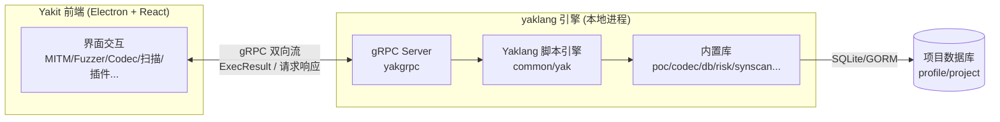
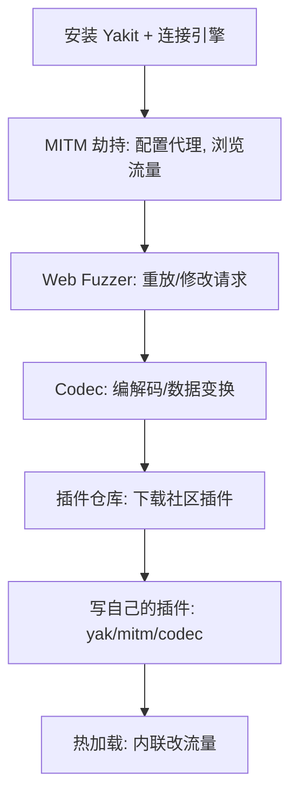

# SKILL: Yakit 基本使用

> AI LOAD INSTRUCTION: Yakit 是 Yak Project 的图形化安全测试平台，由 Electron 前端 + yaklang 引擎后端组成，
> 两者通过 gRPC 通信。本页是"Yakit 界面上有什么、各功能区干什么、引擎怎么连"的入口指南。要写插件/热加载
> 脚本请路由到对应专题 skill（见第 6 节路由表），本页只讲 UI 与基本使用。

## 0. 相关路由

- 总入口：[yak](../yak/SKILL.md)
- 脚本与 UI 交互机制（`yakit.*` 库函数如何驱动界面显示）：[yakit-ui-binding](../yakit-ui-binding/SKILL.md)
- 热加载与插件编程：[mitm-hotpatch](../mitm-hotpatch/SKILL.md) / [webfuzzer-hotpatch](../webfuzzer-hotpatch/SKILL.md) / [global-hotpatch](../global-hotpatch/SKILL.md)
- 原生插件 + cli 参数表单：[yakit-native-plugin](../yakit-native-plugin/SKILL.md)
- 右键 codec 插件：[yakit-rightclick-plugin](../yakit-rightclick-plugin/SKILL.md)

## 1. 架构概览（先理解三层结构）

关键理解：

- **引擎是独立进程**：yaklang 引擎是本地启动的 gRPC 服务（默认端口由引擎自动选择），前端 Electron 应用
  通过 gRPC 双向流与之通信。引擎负责执行所有 yak 脚本、扫描、MITM 代理、发包等"重活"。
- **前端是展示与交互层**：Yakit 前端（React + Electron）不执行安全逻辑，它把用户操作翻译成 gRPC 请求，
  把引擎返回的 `ExecResult` 流渲染成日志、表格、图表、风险卡片等 UI 组件。
- **数据库有两层**：
  - `profile` 数据库：全局配置、插件脚本（YakScript）、Payload 字典、全局 KV、指纹库等。
  - `project` 数据库：随项目切换的历史流量（HTTPFlow）、风险（Risk）、端口资产、域名资产等。

> 源码定位：引擎入口 `yaklang/common/yakgrpc/`；前端 gRPC 流消费 `yakit/app/renderer/src/main/src/hook/useHoldGRPCStream/`；前端路由定义 `yakit/app/renderer/src/main/src/routes/newRoute.tsx`。

## 2. 三种界面模式

Yakit 社区版有三种模式，通过左侧菜单形态区分（`yakit/app/renderer/src/main/src/routes/newRoute.tsx` 中
`YakitModeEnum` 定义）：

| 模式 | 菜单形态 | 适合人群 | 固定 Tab |
|---|---|---|---|
| 安全专家 | 左侧图标条 + 右侧"更多"折叠 | 熟练渗透测试人员 | MITM / Web Fuzzer / History |
| 经典 | 左侧树形折叠菜单 | 入门/习惯传统菜单 | 首页 / History |
| 扫描 | 左侧树形菜单（精简） | 只需批量扫描 | - |

> 模式切换在"系统设置"里，切换后左侧菜单和固定 Tab 随之变化。

## 3. 核心功能区路由表

从前端 `YakitRouteToPageInfo` 和 `RouteToPage` 提取的核心页面（按功能分组）：

### 3.1 渗透测试

| 功能 | 路由 key | 界面用途 | 关联 skill |
|---|---|---|---|
| MITM 交互式劫持 | `mitm-hijack` | 启动 MITM 代理，实时查看/修改/转发 HTTP 流量，加载热加载 hook | [mitm-hotpatch](../mitm-hotpatch/SKILL.md) |
| Web Fuzzer | `httpFuzzer` | 单 Tab 发包调试，支持 fuzztag、热加载、序列发包、数据提取 | [webfuzzer-hotpatch](../webfuzzer-hotpatch/SKILL.md) |
| Websocket Fuzzer | `websocket-fuzzer` | WebSocket 协议发包与 fuzz | - |
| Codec | `codec` | 编解码工具，内置 base64/url/hex/hash 等 + 自定义 codec 插件 | [yakit-rightclick-plugin](../yakit-rightclick-plugin/SKILL.md) |
| 数据对比 | `dataCompare` | 两段数据差异对比 | - |
| Yak Runner | `yakScript` | 在线编写/运行 yak 脚本，等同 IDE | [yaklang-syntax](../yaklang-syntax/SKILL.md) |

### 3.2 安全工具

| 功能 | 路由 key | 界面用途 | 关联 skill |
|---|---|---|---|
| 端口/指纹扫描 | `scan-port` | 端口扫描 + 指纹识别 | - |
| 专项漏洞检测 | `poc` | 基于 PoC 插件批量检测 | [yakit-native-plugin](../yakit-native-plugin/SKILL.md) |
| 弱口令检测 | `brute` | 弱口令爆破 | - |
| 空间引擎 | `space-engine` | 空间测绘引擎搜索（Fofa/Hunter/Quake 等） | - |
| 子域名收集 | `plugin-op`(内置) | 调用"子域名收集"插件 | [yakit-native-plugin](../yakit-native-plugin/SKILL.md) |
| 基础爬虫 | `plugin-op`(内置) | 调用"基础爬虫"插件 | [yakit-native-plugin](../yakit-native-plugin/SKILL.md) |
| 目录扫描 | `plugin-op`(内置) | 调用"综合目录扫描与爆破"插件 | [yakit-native-plugin](../yakit-native-plugin/SKILL.md) |

### 3.3 插件

| 功能 | 路由 key | 界面用途 | 关联 skill |
|---|---|---|---|
| 插件仓库 | `plugin-hub` | 在线插件商店，一键下载安装 | - |
| 批量执行 | `batch-executor-page-ex` | 批量执行多个插件 | [yakit-native-plugin](../yakit-native-plugin/SKILL.md) |
| 插件管理 | `plugin-audit` | 管理已安装插件（启用/禁用/编辑/审核） | - |
| 新建插件 | `add-yakit-script` | 创建新插件（yak/mitm/codec 类型） | [yakit-native-plugin](../yakit-native-plugin/SKILL.md) |

### 3.4 反连

| 功能 | 路由 key | 界面用途 |
|---|---|---|
| DNSLog | `dnslog` | DNS 反连检测 |
| ICMP-SizeLog | `icmp-sizelog` | ICMP 回显检测 |
| TCP-PortLog | `tcp-portlog` | TCP 端口回连检测 |
| Yso-Java Hack | `PayloadGenerater_New` | Java 反序列化 payload 生成 |
| 反连服务器 | `ReverseServer_New` | 统一反连服务器管理 |
| 端口监听器 | `shellReceiver` | 反弹 Shell 监听 |

### 3.5 数据库（项目数据）

| 功能 | 路由 key | 界面用途 | 关联 skill |
|---|---|---|---|
| History | `db-http-request` | MITM/Fuzzer 产生的全部历史流量 | [yakit-data-extract-plugin](../yakit-data-extract-plugin/SKILL.md) |
| 流量分析器 | `db-http-request-analysis` | 历史流量高级分析 | - |
| 漏洞与风险 | `db-risks` | 扫描产出的漏洞/风险列表 | - |
| 报告 | `db-reports-results` | 扫描报告查看 | - |
| 端口 | `db-ports` | 端口资产列表 | - |
| 域名 | `db-domains` | 域名资产列表 | - |
| 指纹库 | `fingerprint-manage` | Web 指纹规则管理 | - |
| CVE 管理 | `cve` | CVE 数据查询 | - |
| 字典管理 | `payload-manager` | Payload 字典管理（与 `db.SavePayload` 联动） | [yaklang-database](../yaklang-database/SKILL.md) |
| 配置管理 | `config-management` | 全局配置（代理/Payload/热加载模板） | [global-hotpatch](../global-hotpatch/SKILL.md) |

### 3.6 AI 功能

| 功能 | 路由 key | 界面用途 |
|---|---|---|
| AIAgent | `ai-agent` | AI 对话与自动化任务 |
| 知识库 | `ai-repository` | AI 知识库管理 |
| 工具库 | `ai-tool` | AI 工具管理 |
| 技能库 | `ai-forge` | AI 技能（Forge）管理 |
| 记忆库 | `ai-memory` | AI 记忆库 |

### 3.7 代码审计

| 功能 | 路由 key | 界面用途 |
|---|---|---|
| 代码扫描 | `yakrunner-code-scan` | 基于 SyntaxFlow 规则扫描代码 |
| 代码审计 | `yakrunner-audit-code` | 代码审计 |
| AI代码审计 | `irify-ai-code-audit` | AI 辅助代码审计 |
| 审计漏洞 | `yakrunner-audit-hole` | 代码审计发现的漏洞 |
| 规则管理 | `rule-management` | 自定义审计规则 |
| 项目管理 | `yakrunner-project-manager` | 审计项目管理 |
| Java 反编译 | `yak-java-decompiler` | Java 类文件反编译 |

## 4. 引擎连接与项目切换

### 4.1 引擎连接

首次启动 Yakit 前端时需要连接引擎：

1. **本地引擎**：在前端"引擎连接"页面选择本地引擎，前端会自动拉起 yaklang 引擎进程。
2. **远程引擎**：输入远程引擎的 gRPC 地址（host:port），前端通过 gRPC 连接。

> 引擎启动入口：`yaklang/common/yakgrpc/`，gRPC 服务端口由引擎自动选择并通过 IPC 通知前端。
> 前端 gRPC 客户端封装：`yakit/app/renderer/src/main/src/services/electronBridge.ts`。

### 4.2 项目切换

Yakit 的"项目"概念对应一个独立的 `project` 数据库：

- 切换项目 = 切换 project 数据库，History/Risk/Port/Domain 等数据随之隔离。
- `profile` 数据库不随项目切换（插件、Payload 字典、全局配置始终共享）。
- 在脚本中用 `db.SetProjectKey` / `db.GetProjectKey` 存取的项目级配置也随项目切换。
  详见 [yaklang-database](../yaklang-database/SKILL.md)。

## 5. 新手快速上手路径

| 步骤 | 操作 | 对应功能区 |
|---|---|---|
| 1. 连接引擎 | 启动 Yakit → 连接本地/远程引擎 | 引擎连接页 |
| 2. MITM 抓包 | 打开 MITM → 设置代理 → 浏览器配置代理 → 浏览目标 | MITM 交互式劫持 |
| 3. 重放/修改 | 在 History 或 MITM 中右键 → 发送到 Web Fuzzer | Web Fuzzer |
| 4. 编解码 | 选中数据 → 右键编码/解码，或打开 Codec 页面 | Codec |
| 5. 装插件 | 打开插件仓库 → 搜索 → 安装 | 插件仓库 |
| 6. 写插件 | 新建插件 → 选类型(yak/mitm/codec) → 写代码 → 保存 | 新建插件 |
| 7. 热加载 | MITM 配置 → 热加载窗口粘贴代码 → 启用 | MITM 热加载 |

## 6. 完整路由表（到各专题 skill）

| 需求 | 进入 skill |
|---|---|
| MITM 代理劫持/修改请求响应 | [mitm-hotpatch](../mitm-hotpatch/SKILL.md) |
| Web Fuzzer 单 Tab 发包加解密/签名/重试 | [webfuzzer-hotpatch](../webfuzzer-hotpatch/SKILL.md) |
| 全局热加载（MITM + Fuzzer 共享） | [global-hotpatch](../global-hotpatch/SKILL.md) |
| 写/读懂 Yaklang 语法 | [yaklang-syntax](../yaklang-syntax/SKILL.md) |
| 数据持久化与查询 | [yaklang-database](../yaklang-database/SKILL.md) |
| 写带参数表单的 yak/mitm 插件 | [yakit-native-plugin](../yakit-native-plugin/SKILL.md) |
| 写右键 codec 插件 | [yakit-rightclick-plugin](../yakit-rightclick-plugin/SKILL.md) |
| 从 History 提取数据驱动扫描 | [yakit-data-extract-plugin](../yakit-data-extract-plugin/SKILL.md) |
| 验证插件/热加载脚本 | [yaklang-toolchain](../yaklang-toolchain/SKILL.md) |
| yak 脚本如何与 Yakit UI 交互 | [yakit-ui-binding](../yakit-ui-binding/SKILL.md) |

## 参考来源

- 前端路由定义：`yakit/app/renderer/src/main/src/routes/newRoute.tsx`（`YakitRouteToPageInfo` / `RouteToPage`）
- 前端 gRPC 流消费：`yakit/app/renderer/src/main/src/hook/useHoldGRPCStream/useHoldGRPCStream.ts`
- 引擎 gRPC 服务：`yaklang/common/yakgrpc/`
- 脚本引擎注入：`yaklang/common/yak/yaklib/yakit_client.go`（`SetEngineClient` 覆写 `yakit` 全局变量）
- 模式枚举：`yakit/app/renderer/src/main/src/store/softMode.ts`（`YakitModeEnum`）