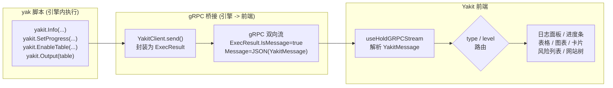

# SKILL: yak 脚本与 Yakit UI 交互机制

> AI LOAD INSTRUCTION: yak 脚本不是孤立的命令行程序——在 Yakit 引擎中运行时，yakit.* 库函数会通过 gRPC
> ExecResult 双向流把结构化消息推送到前端，前端 `useHoldGRPCStream` 按 message type / log level 路由到
> 不同的 UI 组件（日志面板、进度条、表格、图表、风险列表、网站树...）。本页讲清这条完整链路，并给出每个
> UI 输出函数的 API 速查与可运行示例。写插件时想"让界面显示 X"就从这里查。

## 0. 相关路由

- 总入口：[yak](../yak/SKILL.md)
- Yakit 基本使用与功能区说明：[yakit-basic](../yakit-basic/SKILL.md)
- 数据库操作（db 库）：[yaklang-database](../yaklang-database/SKILL.md)
- 原生插件 + cli 参数表单：[yakit-native-plugin](../yakit-native-plugin/SKILL.md)
- 右键 codec 插件：[yakit-rightclick-plugin](../yakit-rightclick-plugin/SKILL.md)
- 验证工具链：[yaklang-toolchain](../yaklang-toolchain/SKILL.md)

## 1. 核心智模型：从 yak 脚本到 UI 的完整链路



关键理解：

1. **yakit.\* 函数不是直接操作 DOM**：它们构造 `YakitLog` / `YakitProgress` / `YakitFeature` 等结构体，
   通过 `YakitClient.send()` 发出。
2. **send 的两种模式**：
   - **VirtualYakitClient**（命令行 `yak xxx.yak`）：send 回调把 `ExecResult` 打印到 stdout（`log.Info`）。
   - **gRPC YakitClient**（Yakit 引擎环境）：send 把 `ExecResult` 通过 gRPC 双向流推到前端。
3. **前端按 type + level 路由**：`useHoldGRPCStream` 解析 `YakitMessage` JSON，按 `type`（`log`/`progress`/
   `status-card`）和 `logData.level`（`json-feature`/`feature-table-data`/`json-risk`/`info`/`warn`/...）
   分发到不同 UI 组件。

> 源码定位：
> - 引擎侧导出：`yaklang/common/yak/yaklib/yakit.go`（`YakitExports` / `GetExtYakitLibByClient`）
> - Client 实现：`yaklang/common/yak/yaklib/yakit_client.go`（`YakitClient.Output` / `YakitLog` / `send`）
> - 消息序列化：`yaklang/common/yak/yaklib/yakit.go`（`MarshalYakitOutput` / `YakitMessageGenerator`）
> - 前端消费：`yakit/app/renderer/src/main/src/hook/useHoldGRPCStream/useHoldGRPCStream.ts`

## 2. 消息协议：YakitMessage 结构

引擎到前端的每条消息都是 `ExecResult{IsMessage: true, Message: JSON}`，其中 `Message` 是
`YakitMessage` 的 JSON 序列化：

```go
// yaklang/common/yak/yaklib/yakit.go
type YakitMessage struct {
    Type    string          `json:"type"`    // "log" / "progress" / "status-card"
    Content json.RawMessage `json:"content"` // YakitLog / YakitProgress / YakitStatusCard
}

type YakitLog struct {
    Level     string `json:"level"`     // info/warn/error/success/debug/code/markdown/text/report/file/
                                         // json-feature/feature-table-data/feature-text-data/
                                         // json-risk/json-table/json-graph/json-httpflow/fingerprint/...
    Data      string `json:"data"`      // 内容或 JSON 字符串
    Timestamp int64  `json:"timestamp"`
}
```

前端 `useHoldGRPCStream` 消费逻辑（简化）：

```typescript
// yakit/app/renderer/src/main/src/hook/useHoldGRPCStream/useHoldGRPCStream.ts
if (obj.type === 'progress') { /* 进度条 */ }
if (obj.type === 'log' && logData.level === 'feature-status-card-data') { /* 状态卡片 */ }
if (obj.type === 'log' && logData.level === 'json-feature') { /* 启用表格/网站树/文本标签页 */ }
if (obj.type === 'log' && logData.level === 'feature-table-data') { /* 表格行数据 */ }
if (obj.type === 'log' && logData.level === 'feature-text-data') { /* 文本标签页数据 */ }
if (obj.type === 'log' && logData.level === 'json-risk') { /* 风险列表 */ }
// 其余 log -> 日志面板
```

## 3. UI 输出函数分类速查

### 3.1 日志输出（日志面板）

| 函数 | UI 展示 | 说明 |
|---|---|---|
| `yakit.Info(format, args...)` | info 级日志行 | 支持 printf 格式化 |
| `yakit.Warn(format, args...)` | warn 级日志行（黄色） | 同上 |
| `yakit.Error(format, args...)` | error 级日志行（红色） | 同上 |
| `yakit.Success(msg)` | success 级日志行（绿色） | 不做 printf，接收已拼好的字符串 |
| `yakit.Debug(msg)` | debug 级日志行 | 同上 |
| `yakit.Text(msg)` | text 块（整块文本） | 多行文本，不做格式化 |
| `yakit.Code(msg)` | code 块（等宽字体） | 代码/报文 |
| `yakit.Markdown(md)` | Markdown 渲染 | 支持标题/列表/表格/加粗 |
| `yakit.Report(id)` | 报告引用 | 按 ID 引用报告 |

> 注意：`yakit.Info` / `yakit.Warn` / `yakit.Error` 支持 printf 格式化（第一个参数是格式串）；
> `yakit.Success` / `yakit.Text` / `yakit.Code` / `yakit.Markdown` **不做** printf，需先用 `sprintf` / f-string 拼好。
> `log.info` 是 printf 风格，打印含 `%` 的内容要用 `log.info("%s", x)` 占位，不能直接字符串拼接。

### 3.2 进度条

| 函数 | UI 展示 | 说明 |
|---|---|---|
| `yakit.SetProgress(f)` | 主进度条 | f 为 0.0~1.0 |
| `yakit.SetProgressEx(id, f)` | 指定 id 的进度条 | 可同时维护多条独立进度条 |

### 3.3 状态卡片（关键指标小卡片）

| 函数 | UI 展示 | 说明 |
|---|---|---|
| `yakit.StatusCard(id, data, tags...)` | 状态卡片 | 相同 id 原地更新；tags 用于分组 |

### 3.4 静态表格（一次性输出）

| 函数 | UI 展示 | 说明 |
|---|---|---|
| `yakit.NewTable(head...)` | 创建表格对象 | head 为列名 |
| `table.Append(row...)` | 追加行 | 每个参数对应一列 |
| `yakit.Output(table)` | 渲染表格 | 统一输出通道 |

> `yakit.NewTable` 是"收集完再统一展示"的静态表格。边扫边出结果用 `EnableTable + TableData`（见 3.5）。

### 3.5 动态表格（实时增量更新）

| 函数 | UI 展示 | 说明 |
|---|---|---|
| `yakit.EnableTable(name, columns)` | 声明一张动态表格 | columns 为列名列表 |
| `yakit.TableData(name, data)` | 向已声明表格写一行 | data 是 map，键对应列名；可含 "uuid" 控制行标识 |

> `EnableTable` 发送 `json-feature`(feature=`fixed-table`) 声明表格，`TableData` 发送 `feature-table-data`
> 逐行写入。用相同 uuid 再次写入可"更新"同一行。

### 3.6 图表

| 函数 | UI 展示 | 说明 |
|---|---|---|
| `yakit.NewLineGraph(name...)` | 折线图 | 趋势展示 |
| `yakit.NewBarGraph(name...)` | 柱状图 | 分类对比 |
| `yakit.NewPieGraph(name...)` | 饼图 | 占比/构成 |
| `yakit.NewWordCloud(name...)` | 词云 | 关键词频率 |
| `graph.Add(key, value)` | 添加数据点 | 所有图表通用 |
| `yakit.Output(graph)` | 渲染图表 | 统一输出通道 |

> 四种图表构造器签名完全一致，仅展示形态不同。图表对象通过 `yakit.Output` 发送，前端按 `json-graph` level 渲染。

### 3.7 网站树

| 函数 | UI 展示 | 说明 |
|---|---|---|
| `yakit.EnableWebsiteTrees(targets)` | 网站树标签页 | targets 为逗号分隔的目标 |

### 3.8 文本标签页

| 函数 | UI 展示 | 说明 |
|---|---|---|
| `yakit.EnableText(tabName)` | 文本标签页 | 声明一个文本标签页 |
| `yakit.TextTabData(tabName, data)` | 文本标签页数据 | 向已声明的标签页追加文本 |

### 3.9 DOT 图标签页

| 函数 | UI 展示 | 说明 |
|---|---|---|
| `yakit.EnableDotGraphTab(tabName)` | DOT 图标签页 | 声明标签页 |
| `yakit.OutputDotGraph(tabName, dotData)` | DOT 图数据 | 输出 Graphviz DOT 字符串 |

### 3.10 统一输出通道

| 函数 | 说明 |
|---|---|
| `yakit.Output(obj)` | 自动按对象类型选择输出通道：Table/Graph/Risk/HTTPFlow/Fingerprint/StatusCard/TableData/... |

> `yakit.Output` 是"智能路由"——传入 `*YakitTable` 走 `json-table`，传入 `*YakitGraph` 走 `json-graph`，
> 传入 `*schema.Risk` 走 `json-risk`，传入 `*fp.MatchResult` 走 `fingerprint`，传入 `*YakitFixedTableData`
> 走 `feature-table-data`，传入 `*YakitStatusCard` 走 `feature-status-card-data`...
> 这意味着可以把扫描器的原生结果对象直接 Output 出去，由前端渲染成对应的卡片/表格。

### 3.11 风险与文件

| 函数 | UI 展示 | 说明 |
|---|---|---|
| `risk.NewRisk(url, risk.title(...), ...)` | 风险列表 | 详见各 hotpatch skill 中的 risk 用法 |
| `yakit.NewHTTPFlowRisk(...)` | HTTP 流量风险 | 带请求/响应的风险对象 |
| `yakit.File(path, desc...)` | 文件卡片 | 文件信息/操作记录 |
| `yakit.FileReadAction(...)` 等系列 | 文件操作记录 | 读/写/创建/删除/状态/权限/查找 |

### 3.12 流式输出

| 函数 | UI 展示 | 说明 |
|---|---|---|
| `yakit.Stream(streamType, streamId, reader)` | 流式日志 | 逐字符读取 reader 并推送 |

## 4. 完整示例：一个输出多种 UI 组件的插件

```yak
// 关键词: yakit.Output, EnableTable, TableData, StatusCard, SetProgress, NewTable, NewBarGraph, Markdown
// 适用: yak 原生插件（在 Yakit 中执行时各 UI 组件实时展示）

func runPlugin() {
    // 1. 进度条
    yakit.SetProgress(0)

    // 2. 状态卡片（关键指标）
    yakit.StatusCard("Targets", "0/10", "progress")

    // 3. 动态表格（边扫边出）
    yakit.EnableTable("Port Scan Result", ["host", "port", "service"])

    // 模拟扫描
    results = [["10.0.0.1", "80", "http"], ["10.0.0.1", "443", "https"], ["10.0.0.2", "22", "ssh"]]
    for i = 0; i < len(results); i++ {
        r = results[i]
        // 写动态表格
        yakit.TableData("Port Scan Result", {"host": r[0], "port": r[1], "service": r[2]})
        // 更新进度与卡片
        yakit.SetProgress(float(i + 1) / float(len(results)))
        yakit.StatusCard("Targets", sprintf("%d/%d", i + 1, len(results)), "progress")
        yakit.Info("scanned %s:%s -> %s", r[0], r[1], r[2])
        sleep(0.05)
    }
    yakit.SetProgress(1.0)
    yakit.StatusCard("Targets", "10/10", "done")

    // 4. 静态表格（汇总）
    table = yakit.NewTable("Host", "Port", "Service")
    for r in results { table.Append(r[0], r[1], r[2]) }
    yakit.Output(table)

    // 5. 柱状图
    graph = yakit.NewBarGraph("port distribution")
    graph.Add("80", 1)
    graph.Add("443", 1)
    graph.Add("22", 1)
    yakit.Output(graph)

    // 6. Markdown 报告
    yakit.Markdown(sprintf("# Scan Report\n\n- hosts: 2\n- open ports: %d\n", len(results)))
    yakit.Success("scan completed")
}

func runSelfTest() {
    // 命令行自测: 调用纯函数验证逻辑，不依赖 UI
    // yakit.* 在命令行环境走 VirtualYakitClient, 输出到 stdout
    runPlugin()
    assert true, "should complete without error"
}

if YAK_MAIN {
    runSelfTest()
}
```

## 5. 命令行环境下的 yakit.* 行为（重要）

当脚本不在 Yakit 引擎中运行（即 `yak xxx.yak` 命令行运行）时：

- `AutoInitYakit()` 检测到没有 `--yakit-webhook` 参数 → 使用 `emptyVirtualClient`（`NewVirtualYakitClient`）。
- `emptyVirtualClient` 的 send 回调把 `ExecResult` 打印到 `log.Info`（即 stdout）。
- 因此 `yakit.Info("hello")` 在命令行下等同于 `log.Info("hello")`，`yakit.Output(table)` 会打印
  table 的 JSON。

**这意味着**：含 `yakit.*` 调用的脚本在命令行下不会崩溃，所有输出退化为日志打印。所以
"先在命令行自测逻辑，再粘回 Yakit 使用"的安全调试闭环依然成立。

> 源码：`yaklang/common/yak/yaklib/yakit.go` 中 `emptyVirtualClient` 和 `AutoInitYakit`。

## 6. 引擎如何注入 yakit 全局变量

引擎启动脚本前，通过 `SetEngineClient` 把一个 `YakitClient` 实例注入为脚本的 `yakit` 全局变量：

```go
// yaklang/common/yak/yaklib/yakit_client.go
func SetEngineClient(e *antlr4yak.Engine, client *YakitClient) {
    e.OverrideRuntimeGlobalVariables(map[string]any{
        "yakit": GetExtYakitLibByClient(client),
        "risk":  map[string]any{ /* risk 库, 内部用 client 做 risk 输出 */ },
    })
    InitYakit(client)  // 设置全局默认客户端
}
```

`GetExtYakitLibByClient(client)` 返回一个 `map[string]interface{}`，其中每个 key 就是脚本能调用的
`yakit.xxx` 函数名，value 是绑定到该 client 的函数。因此同一个脚本在不同 client 下运行：
- gRPC client → 输出到前端 UI
- VirtualYakitClient → 输出到 stdout
- 空 client → 输出被丢弃

## 7. 前端 useHoldGRPCStream 消费逻辑详解

前端 `useHoldGRPCStream` 是所有插件/扫描结果展示的核心 hook，它：

1. 通过 `yakitStream.onData(token, callback)` 监听 gRPC 流。
2. 每收到一个 `ExecResult`，解析 `YakitMessage` JSON。
3. 按 `type` + `level` 路由到不同缓冲区：

| `type` | `level` | 前端缓冲区 | UI 组件 |
|---|---|---|---|
| `progress` | - | `progressKVPair` (Map) | 进度条 |
| `log` | `feature-status-card-data` | `cardKVPair` (Map) | 状态卡片 |
| `log` | `json-feature` (feature=`fixed-table`) | `tabTable` (Map) | 动态表格 Tab |
| `log` | `json-feature` (feature=`website-trees`) | `tabWebsite` | 网站树 Tab |
| `log` | `json-feature` (feature=`text`) | `tabsText` (Map) | 文本 Tab |
| `log` | `feature-table-data` | 更新 `tabTable` 中对应表格 | 动态表格行 |
| `log` | `feature-text-data` | 更新 `tabsText` | 文本标签页内容 |
| `log` | `json-risk` | `riskMessages` (Array) | 风险列表 |
| `log` | `info`/`warn`/`error`/`success`/`debug`/`text`/`code`/`markdown` | `messages` (Array) | 日志面板 |
| `log` | `json-table` | `messages` (Array) | 日志面板（静态表格 JSON） |
| `log` | `json-graph` | `messages` (Array) | 日志面板（图表 JSON） |

4. 定时（默认 500ms）把缓冲区快照到 React state，触发 UI 重渲染。

> 理解这条链路后，你就知道"写 `yakit.EnableTable` 时前端在做什么"——它在等 `json-feature` 消息来
> 建表格 Tab，再等 `feature-table-data` 消息逐行填充。

## 8. 坑与注意事项

| 坑 | 错误做法 | 正确做法 |
|---|---|---|
| `yakit.Info` 含 `%` 直接拼接 | `yakit.Info("progress: 50%")` | `yakit.Info("progress: 50%%")` 或 `yakit.Info("%s", "progress: 50%")` |
| `yakit.Success` 当 printf 用 | `yakit.Success("found %d", n)` | `yakit.Success(sprintf("found %d", n))` |
| 动态表格 `TableData` 没先 `EnableTable` | 直接 `TableData` | 先 `EnableTable` 声明，再 `TableData` 写行 |
| 表格 data 中含嵌套对象/数组 | `yakit.TableData("t", {"info": {"a": 1}})` | 展平为基本类型，前端过滤掉含对象的行 |
| 状态卡片 id 不固定 | 每次随机 id | 用固定 id 实现原地更新 |
| 并发 hook 里调用 yakit.* | 多个 goroutine 同时 yakit.Info | `yakit.*` 本身并发安全（send 是线程安全的），但避免在 hook 里大量 yakit.Info 影响性能 |

## 9. 示例 (examples/)

| 文件 | 演示内容 | 验证 |
|---|---|---|
| [examples/ui-output-tour.yak](examples/ui-output-tour.yak) | 日志/进度条/状态卡片/静态表格/动态表格/柱状图/Markdown 全链路 | `yak <file>` 自测 |

## 10. 验证

```bash
cd /Users/v1ll4n/Projects/yaklang
go run common/yak/cmd/yak.go skills/yakit-ui-binding/examples/ui-output-tour.yak
```

命令行运行时，`yakit.*` 走 `VirtualYakitClient`，所有输出退化为 stdout 日志。
在 Yakit 中运行同一脚本，各 UI 组件实时展示。

合格标准：10 秒内完成、无 panic、log 全英文、末尾出现 `... self test passed`。

## 参考来源

- 引擎侧 yakit 库导出：`yaklang/common/yak/yaklib/yakit.go`（`YakitExports` / `GetExtYakitLibByClient`）
- Client 实现：`yaklang/common/yak/yaklib/yakit_client.go`（`YakitClient.Output` / `YakitLog` / `send`）
- Viewer 扩展（EnableTable/StatusCard 等）：`yaklang/common/yak/yaklib/yakit_viewer.go`
- 消息序列化：`yaklang/common/yak/yaklib/yakit.go`（`MarshalYakitOutput` / `YakitMessageGenerator`）
- 脚本执行：`yaklang/common/yak/yakscript/exec.go`（`ExecScriptWithParam` / `ExecScriptWithExecParam`）
- 前端 gRPC 流消费：`yakit/app/renderer/src/main/src/hook/useHoldGRPCStream/useHoldGRPCStream.ts`
- 前端类型定义：`yakit/app/renderer/src/main/src/hook/useHoldGRPCStream/useHoldGRPCStreamType.d.ts`
- 前端结果展示：`yakit/app/renderer/src/main/src/pages/plugins/operator/pluginExecuteResult/PluginExecuteResult.tsx`